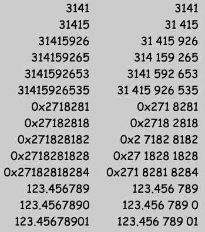

My hacking here got too messy, so I've [started
over](https://github.com/sh1boot/digitgrouper/).

# Numderspace
Based substantially on [Numderline](https://github.com/trishume/numderline) but
becoming kind of its own thing as I hack around.

Allows the rendering of digit grouping (thousand separators) in contexts where
you have some control over the font but don't want to (or can't) edit the text
inline.  It looks a bit like this:



This is achieved by adding font features to font files which enable outboard
configuration of number formatting.

Provisional names for the features are:
 - `dgsp` to enable digit grouping with spaces
 - `dgco` to enable digit grouping of whole numbers with commas
 - `dgcd` as above, but inserting commas into the decimals as well
 - `dgdo` to enable digit grouping of whole numbers with dots (and replacing dot with comma, use with caution)
 - `dgdd` as above, but inserting dots into the decimals as well

Used in contexts where these features cannot be switched on externally, it's
possible to rename the first verison to something which will be enabeld by
default, like `calt`.

## Usage
Patch a font to add the extra stuff.  Then, if you have [CSS
control](https://developer.mozilla.org/en-US/docs/Web/CSS/font-feature-settings)
over the font, try:

```CSS
font-feature-settings: "dgsp";
```
for the bits you want formatted that way (try to avoid switching it on
globally, as it may mess other things up).


To use it in a terminal (if you have one which supports ligation), you can use
a monospaced font and pass `--monospace` to the patcher so that it will
squeeze glyphs appropriately.

Usage might be configured with a line like:
```
font=My Font with DigitGrouping:fontfeatures=dgsp
```
or
```
font_features My-Font-with-DigitGrouping dgsp
```
or, in fontconfig:
```xml
    <match target="pattern">
         <test name="family" compare="contains"><string>DigitGrouping</string></test>
         <edit name="fontfeatures" mode="append">
             <string>dgsp</string>
         </edit>
     </match>
```

Here's some other documentation about using stylistic sets (just change `ss01` to `dgsp`):
 - https://github.com/tonsky/FiraCode/wiki/How-to-enable-stylistic-sets

Or if all of that is too much hassle or isn't working out right, just bake it
in as the default, by passing `--feature-name=calt` to the patcher.
